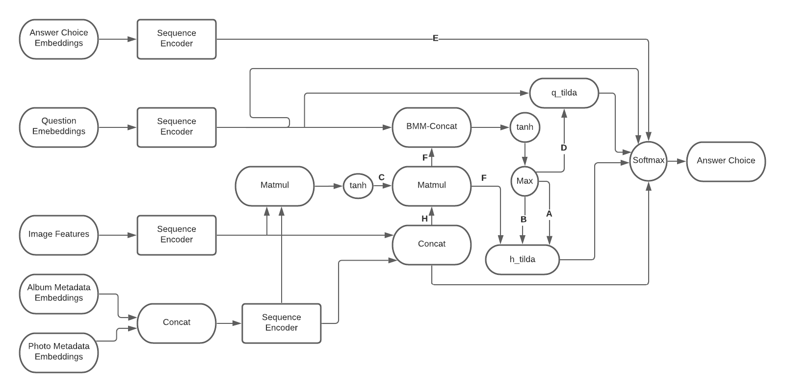

## Tackle Multimodal QA with Multi-Stage Information Fusion
**Team Name: sunday-dues**
**Authors: Yichun Li, Hongyuan Zhang, Aditi Tripathi**
## Abstract 
Multimodal question answering has wide applications in real life, for example, intelligent voice assistants. In this paper, we propose a novel approach to a less explored task within the realm of multimedia question answering: MemexQA, in which a large number of photos from multiple personal albums, as well as related metadata are given to answer a multiple-choice question. Our approach features a multi-stage fusion process of multimodal information, which consists of dynamic parameter prediction and multimodal convolution. We achieved results that reflected both strengths and weaknesses of the proposed novel solution.

**Dataset: MemexQA Dataset**
[MemexQA Dataset](https://memexqa.cs.cmu.edu)

## Models
### Fusion model

EPOCHS = 10,
BATCH_SIZE = 64,
MOMENTUM = 1e-2,
LR = 1e-2,
LR_STEPSIZE = 3,
LR_DECAY = 0.85,
WD = 5e-6
### Attention model

EPOCHS = 80,
BATCH_SIZE = 64,
HIDDEN_SIZE = 512,
NUM_LAYERS = 3,
KERNEL = 5,
STRIDE = 1,
DROPOUT = 0.4,
#MOMENTUM = 1e-2,
LR = 0.32,
WD = 5e-5,
FACTOR = 0.95,
PATIENCE = 3,
THRESHOLD = 0.01

### Baselines

